**COMPUTER SCIENCE AND ENGINEERING**  
---

**EXPERT MAPPING INTERFACE**

**USER GUIDE**

Zoey Vo, Loc Nguyen, Alyssa Vallejo, Marina Mata

Department of Computer Science  
University of California, Davis  
ECS 193A

Spring 2025

| TABLE OF CONTENTS | PAGE |
| ----- | :---: |
|  |  |
| **INTRODUCTION** | 2 |
| 1.1 Preface | 2 |
| 1.2 Overview of Product | 2 |
| 1.3 Target Audience | 2 |
| 1.4 Guide Structure | 2 |
| **ACCESS AND SYSTEM REQUIREMENTS** | 2 |
| 2.1 System Requirements | 2 |
| 2.2 Accessing the Interface | 2 |
| **FEATURES AND FUNCTIONALITY** | 3 |
| 3.1 Interactive Map Overview | 3 |
| 3.2 Search and Filtering | 3 |
| 3.3 Cluster and Zoom Logic | 3 |
| 3.4 Hovering, Side Panel, and Profile Details | 3 |
| 3.5 Mobile View Operation | 3 |
| **SYSTEM ARCHITECTURE** | 3 |
| 4.1 Frontend Interface | 4 |
| 4.2 Data Flow Pipeline | 4 |
| 4.3 Backend Services | 4 |
| 4.4 Docker and GCP Deployment | 4 |
| **DEPLOYMENT & OPERATION** | 5 |
| 5.1 Local Development | 5 |
| 5.2 Production Development | 5 |
| 5.3 Docker Management | 5 |
| **TROUBLESHOOTING** | 6 |
| **CONTACT INFORMATION** | 6 |
| **GLOSSARY** | 6 |
| **APPENDIX** | 7 |
| 9.1 Project Overview and User Stories | 7 |
| 9.2 Referenced Diagrams | 7 |

# 

# **Expert Mapping Interface (E.M.I)**

## **1\. Introduction**

### **1.1 Preface**

The Expert Mapping Interface (E.M.I) is a web application developed for the UC Davis Library to visualize global research output by UC Davis scholars. This user guide outlines how to access, navigate, and understand the features of the E.M.I.

### **1.2 Overview of Product**

E.M.I allows users to explore grants and scholarly works geographically. Using NLP and geospatial tools, the application extracts and maps research activity tied to real-world locations, making discovery more intuitive.

### **1.3 Target Audience**

Designed for students, journalists, donors, researchers, and the public who are interested in research activity by location.

### **1.4 Guide Structure**

The guide starts with access instructions, then covers key features, system design, troubleshooting, and contact information.

---

## **2\. Access and System Requirements**

### **2.1 System Requirements**

* Modern browser (Chrome, Firefox, Safari)  
* Internet access  
* Desktop or mobile device

### **2.2 Accessing the Interface**

* Navigate to: [http://35.247.92.204:3001](http://35.247.92.204:3001). No login or installation is required.  
* Expect an initial 2-5 second loading delay.  
* Ensure Pop-Ups/Adblockers are disabled.

---

**3\. Features and Functionality**

### **3.1 Interactive Map Overview**

* The homepage shows a global map with colored clusters and markers. Zoom dynamically reveals heatmaps or individual pins. Hovering shows a popup; clicking opens a side panel with expert and work details.  \[*Figure 1*\]

### **3.2 Search and Filtering**

* These filters are automatically applied to the entries on the map, can be reset via ‘Reset Filters’
* **Keyword Search:** Matches expert name, department, work and grant titles, publication abstracts.  
* **Date Range Slider:** Filter by date of work or grant.  
* **Toggles:** Show/hide grants or works.  

### **3.3 Cluster and Zoom Logic**

* **Low zoom:** Clusters and polygons summarize dense regions.  
* **High zoom:** Individual pins with detailed info appear.  
* **Heatmap layer:** Shows density without clutter.

### **3.4 Hovering, Side Panel, and Profile Details**

* Upon hovering a marker, a popup appears displaying the number of matching experts and their works or grants.  
* Clicking on “View Experts” opens a sidebar listing all associated experts. Each Profile Detail includes metadata about the related grants or works, along with a clickable link leading to the expert’s profile on the Aggie Expert website.  \[*Figure 2*\]

### **3.5 Mobile View Operation**

Move your finger over markers and click on them to display experts at that location. Filters can be found in the button with a funnel on it. Click it and it will display the date slider and show works/grants toggles. The search bar remains on the right of the navigation bar. \[*Figures 3,4,5*\]

The map guide can be found underneath the filters button and displays the map guide in the center of the screen.

---

## **4\. System Architecture**

### **4.1 Frontend Interface** \[*Figures 6,7,8*\]

* React.js application using Leaflet for maps  
* Tailwind CSS for styling  
* Responsive and accessible UI

### **4.2 Data Flow Pipeline**  \[*Figures 8,9,10*\]

* Aggie Experts API provides raw expert data.  
  LLaMA extracts geographic entities from texts.  
* Nominatim geocodes locations.  
* GeoJSON data is stored in PostGIS.  
* Redis caches results.  
* React frontend renders UI.

### **4.3 Backend Services** \[*Figure 9,10*\]

* Node.js Express API serves endpoints  
* Redis provides cache acceleration  
* PostGIS stores location-based records

### **4.4 Docker and GCP Deployment Architecture**  \[*Figure 11*\]

The E.M.I is deployed using Docker containers on a Google Cloud Platform (GCP) virtual machine. The architecture includes:

* **Docker Compose** orchestrates multiple containers:  
  * emi-app: The main Node.js/React application container.  
  * emi-redis: Redis container for caching expert profiles.  
  * emi-postgis: PostGIS container for geospatial data storage.

* **Images** for each service are built locally or pulled from Docker Hub (e.g., postgis/postgis, redis).  
* **Manual Image Updates**: The EMI app image can be rebuilt locally, saved as a tarball, and securely copied to the GCP VM for loading and deployment.  
* **Persistent Volumes**: Data for Redis and PostGIS is stored in Docker volumes to ensure persistence across container restarts.  
* **Networking**: Docker Compose sets up an internal network for inter-container communication. The application is exposed on port 3001, accessible via the VM's external IP.  
* **Startup/Shutdown**: Use docker compose up \-d to start all services and docker compose down to stop them. Logs and container status can be monitored with standard Docker commands.

This setup enables rapid deployment, easy updates, and reliable operation in a cloud environment, supporting both development and production workflows.

For a more detailed system architecture, developers can refer to src/backend/etl/README.md or the following Github repo: [https://github.com/UCD-193AB-ws24/expert-mapping-interface](https://github.com/UCD-193AB-ws24/expert-mapping-interface)

---

## 

## 

## **5\. Deployment and Operations**

### **5.1 Local Development**

* git clone [https://github.com/UCD-193AB-ws24/expert-mapping-interface](https://github.com/UCD-193AB-ws24/expert-mapping-interface)  
* Build the frontend: npm run build  
* Start the backend: node src/backend/server.js  
* Access locally at: [http://localhost:3001](http://localhost:3001)

### **5.2 Production Deployment**

* Push changes to the main repository branch  
* CI/CD pipeline is triggered automatically  
  * EMI Docker image is built  
  * Image is transferred to the virtual machine (VM)  
  * Image is unpacked and deployed on the VM  
* Application is available at: [http://35.247.92.204:3001/](http://35.247.92.204:3001/)

### **5.3 Docker Management**

#### **Images**

#### **Creating/Updating Postgis Image:**

* **Local:**  
  * git clone [https://github.com/UCD-193AB-ws24/expert-mapping-interface](https://github.com/UCD-193AB-ws24/expert-mapping-interface)  
  * docker build \-f ./Dockerfile.emi \-t emi .  
  * docker save \-o "C:\\image\_path\\emi.tar" emi  
  * scp \-i .\\key\_path\\private\_key .\\image\_path\\emi.tar \<user\>@\<host\>:\~  
* **VM:**  
  * docker compose down  
  * Docker rmi \<emi-img-id\>  
  * docker load \-i \~/emi.tar  
  * docker compose up \-d  
  * docker cp expertIds.csv emi-app:/app/src/backend/etl/aggieExpertsAPI/utils

#### **Creating Postgis Image:** docker pull postgis/postgis

#### **Creating Redis Image:** docker pull redis

#### **Deploying**

* Deploy containers: docker compose up \-d  
* View startup logs: docker compose logs \-f  
* Inspect containers: docker ps

#### **Accessing Containers**

* EMI: docker exec \-it emi-app sh  
* Redis: docker exec \-it emi-redis redis-cli  
* PostGIS: docker exec \-it emi-postgis psql \-U postgres

#### **Removing**

* docker compose down -v

---

## **6\. Troubleshooting**

* **Why is the map not loading?**  
  * The map may take a few seconds to load due to the large dataset. If it does not load after a short wait, please try reloading the page.  
* **Why are no results being returned?**  
  * Results are displayed based on the current zoom level, so try zooming in to explore the map further. Another possible reason is that the filter parameters are too specific, in which case, you can adjust the filters or reload the page to reset them.  
* **Why are the hover tooltips not working?**  
  * Ensure your browser is up to date and that you are not running any extensions that may block scripts.

---

## **7\. Contact Information**

* Zoey Vo — ausvo@ucdavis.edu, [@zoeyvo](https://github.com/zoeyvo)  
* Alyssa Vallejo — anvallejo@ucdavis.edu, [AV-CompSci-Mage](https://github.com/AV-CompSci-Mage)  
* Marina Mata — mmbmata@ucdavis.edu, [@marinamata](https://github.com/marinamata)  
* Loc Nguyen — lctnguyen@ucdavis.edu, [@loctng](https://github.com/loctng)

---

## **8\. Glossary**

* **ETL:** Extract, Transform, Load pipeline  
* **GeoJSON:** JSON format for geographic features  
* **PostGIS:** Extension of PostgreSQL for geospatial queries  
* **Redis:** In-memory data store for caching  
* **LLaMA:** Language model for extracting location entities

---

## 

## **9\. Appendix**

### **9.1 Project Overview and User Stories**

1. As a site user, I want a highlight of the reasons for matching profiles so that I can save time looking through each profile and focus on the relevant ones.  
2. As a student, I want search results to be accurate and organized by relevance so that I can find the best fit.  
3. As a student with a passion for research, I want to see what research is happening in specific regions so that I can find fieldwork internships.  
4. As a potential donor, I want to see research projects in specific fields so that I can find and support impactful work.  
5. As a journalist, I want to see where UC Davis researchers are conducting studies so that I can write stories on impactful research in different regions of the world.  
6. As a researcher, I want to see my works represented accurately to ensure that those interested in what I do can contact me.  
7. As a site user, I want the results on the map to be not clustered so it will be easier for me to look through the results.  
8. As a graduate student, I want to be able to contact researchers who have or are currently working in my field of research so that I can ask for their expert opinions or collaboration.  
9. As a site user, I want the map to have high accuracy so that the searching process can be more convenient.  
10. As a researcher, I want a professional profile that displays my work and contact information so that interested individuals are encouraged to reach out to me.

### **9.2 Diagrams**

  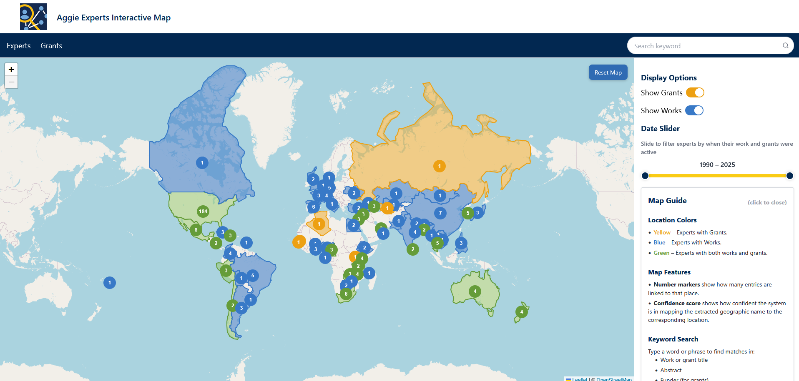
  
<em>Figure 1</em>

---

  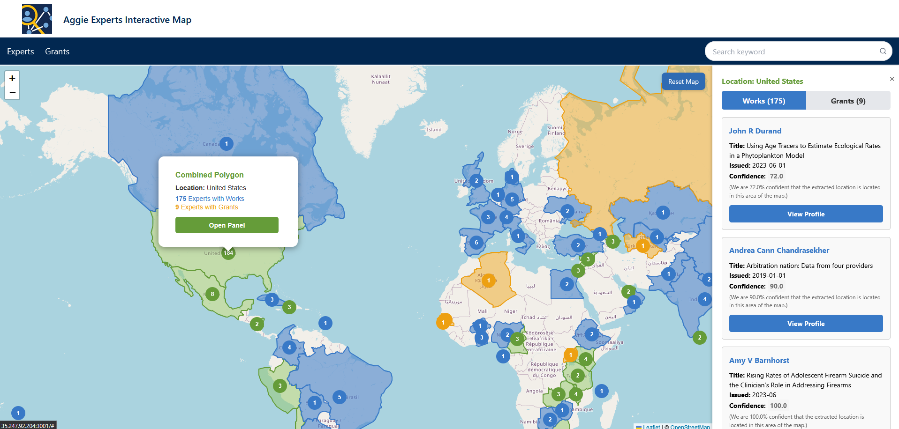
  
<em>Figure 2</em>

  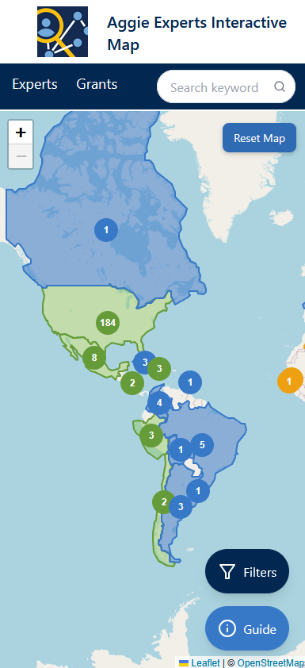
  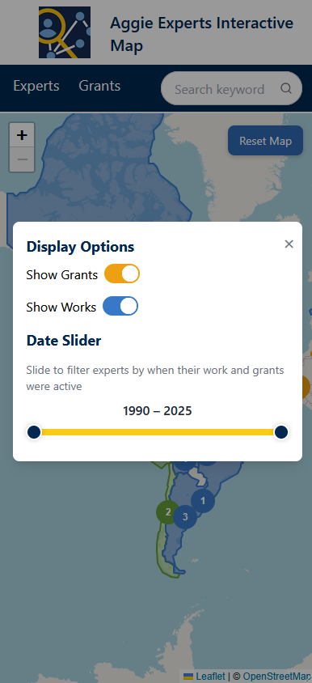
  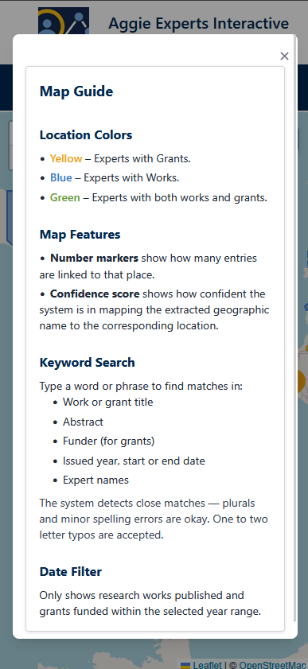
  
<em>Figure 3&emsp;Figure 4&emsp;Figure 5</em>

  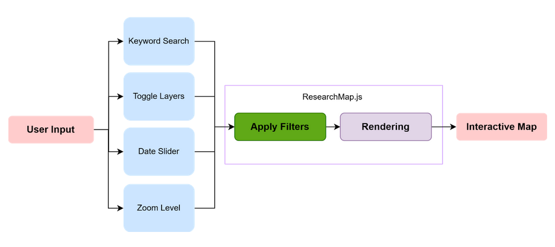
  
<em>Figure 6</em>

---

  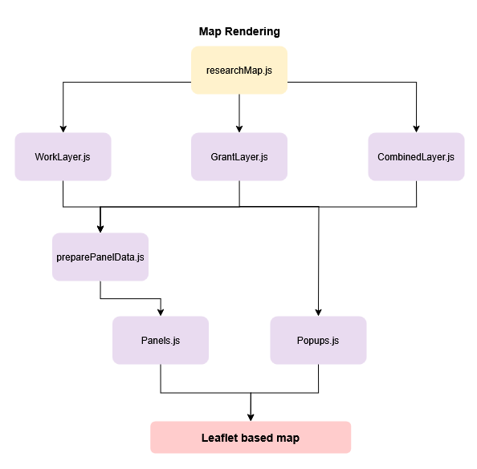
  
<em>Figure 7</em>

  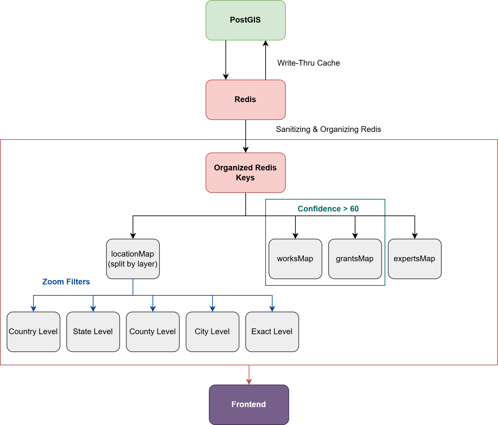
  
<em>Figure 8</em>

---

  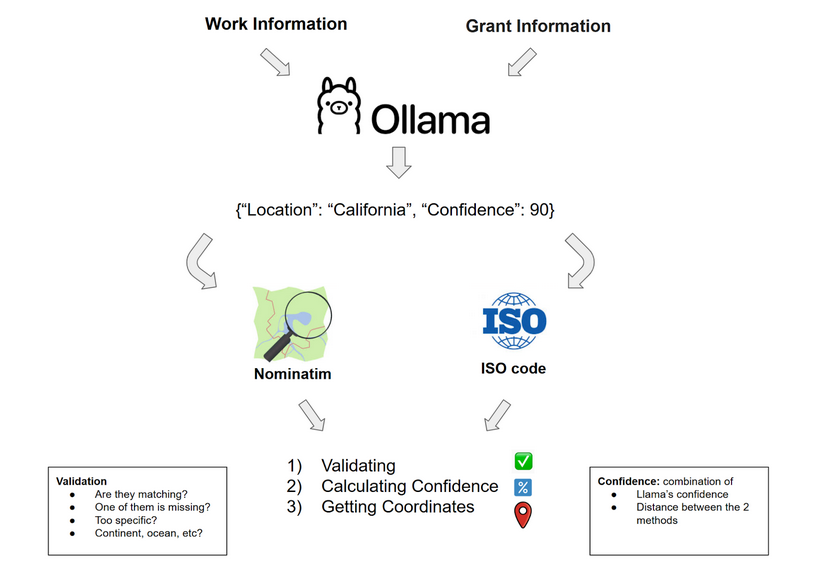
  
<em>Figure 9</em>

  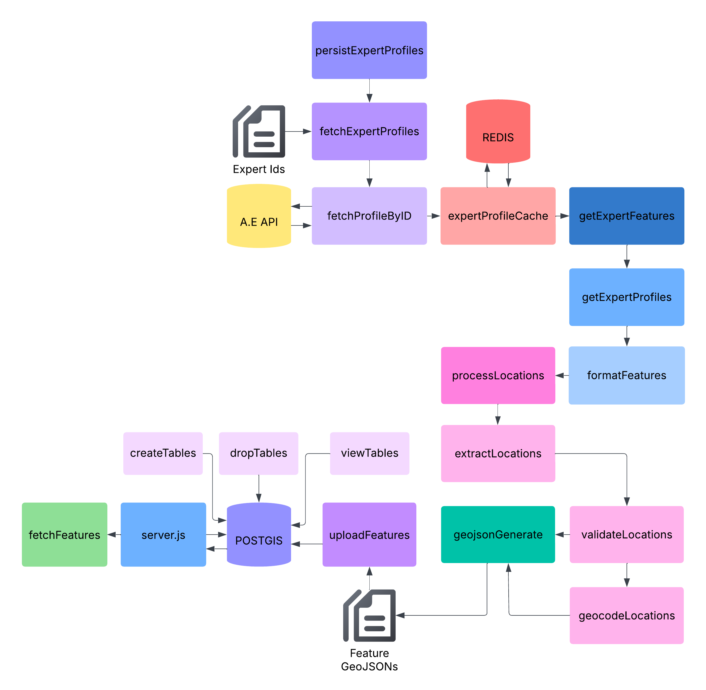
  
<em>Figure 11</em>

  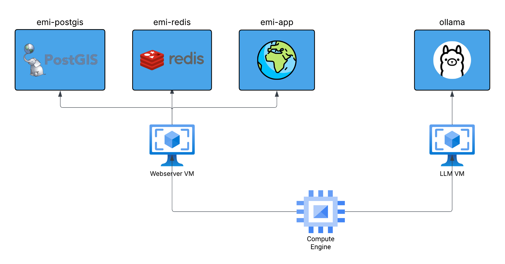
  
<em>Figure 11</em>

---

For technical details regarding frontend rendering, refer to src/frontend/components/[README.md](http://README.md).

For technical details regarding ETL pipeline, refer to src/backend/etl/[README.md](http://README.md).

For technical details regarding PostGIS, refer to src/backend/postgis/[README.md](http://README.md).

---

*Zoey Vo, Alyssa Vallejo, Marina Mata, Loc Nguyen, 2025*
