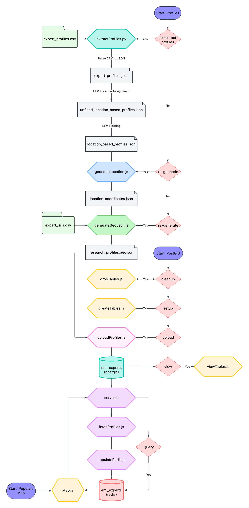

# UC Davis Research Around the World

## Team 17 - Expert Mapping Interface (EMI)
**Zoey Vo, Alyssa Vallejo, Marina Mata, Loc Nguyen**

---

## Project Overview

### Introduction
The **Aggie Experts Expert Mapping Interface (E.M.I)** addresses the challenge of visualizing research studies, grants, and scholarships among UC Davis researchers based on their affiliated geographic locations. Currently, finding relevant research or experts is limited to keyword-based text searches, which often yield ambiguous or irrelevant results.

Our solution introduces an **interactive, user-friendly map** that allows users to discover spatially relevant researchers by navigating intuitively through geographic regions. Users can click on different areas to explore researchers, their work, and grants, bridging the gap between text-based searches and spatially contextualized research discovery.

### Problem Statement
Current UC Davis researcher databases rely on static search interfaces that:
- **Lack spatial context**, making it difficult to identify region-specific experts.
- **Suffer from ambiguity** (e.g., homonyms like “Turkey” the country vs. “turkey” the bird).
- **Overwhelm users with unstructured data** in research-dense regions (e.g., hundreds of experts in California).

### Solution: E.M.I
The **Expert Mapping Interface** displays research expert information using:
- **Dynamic Clustering**: Automatically groups researchers in dense areas (e.g., California) into clusters that expand on zoom.
- **Geospatial Precision**: Pins link to researcher profiles, grants, and publications, filtered by relevance to the selected region.
- **Multi-Scale Visualization**: Displays continental trends at a macro level and granular details (country, region, city, etc.) dynamically on zoom.

---

## System Architecture

---

## Technology Stack

### Backend
- **PostGIS**: Geospatial database for storing and querying researcher locations as GeoJSON. Enables complex queries (e.g., “Show all experts within 50km of Santiago, Chile”).
- **Node.js**: RESTful API handling data fetching, filtering, and aggregation.
- **Ollama**: Language model processing for enhanced search and query refinement.

### Frontend
- **React.js**: Dynamic UI components for seamless map interactions.
- **Leaflet**: Open-source library for rendering vector maps with smooth zoom/pan and custom layers.
- **Tailwind CSS**: Responsive, utility-first styling aligned with UC Davis branding.
- **Redis**: Efficient caching store for expert profiles.

---

## Alpha Version Features

### Core Features
- **Interactive map** with clickable features (points/polygons).
- **Researcher pins linked to Aggie Experts profiles.**

### Anti-Clutter Measures
- **Progressive Disclosure**: Show high-level trends (e.g., “50 experts in Brazil”) on low zoom; individual pins on high zoom.
- **Heatmap Overlay**: Visualize research density without overlapping pins.

### False Positive Mitigation
- **Contextual Queries**: Search for “Turkey” prioritizes country-based results using geospatial context over text matching.

### UC Davis Branding
- **Cohesive UI** adhering to university style guides, integrating official colors, logos, and accessibility standards.

---

## User Stories (Prioritized)
- **As a site user**, I want a highlight of the reasons for matching profiles so that I can save time looking through each profile and focus on the relevant ones.
- **As a student**, I want search results to be accurate and organized by relevance so that I can find the best fit.
- **As a student with a passion for research**, I want to see what research is happening in specific regions so that I can find fieldwork internships.
- **As a potential donor**, I want to see research projects in specific fields so that I can find and support impactful work.
- **As a journalist**, I want to see where UC Davis researchers are conducting studies so that I can write stories on impactful research in different regions of the world.
- **As a researcher**, I want to see my works represented accurately to ensure that those interested in what I do can contact me.
- **As a site user**, I want the results on the map to be not clustered so it will be easier for me to look through the results.
- **As a graduate student**, I want to be able to contact researchers who have or are currently working in my field of research so that I can ask for their expert opinions or collaboration.
- **As a site user**, I want the map to have high accuracy so that the searching process can be more convenient.
- **As a researcher**, I want a professional profile that displays my work and contact information so that interested individuals are encouraged to reach out to me.

---

## Development Considerations

### Cost
- **Leaflet.js - Mapping**: Free and open source.
- **Nominatim API - Geocoding**: Free tier and open source.
- **Ollama - NER**: Free and open source, AWS hosting needed for scaling.
- **PostGIS - Spatial DB**: Free and open source, AWS hosting needed for scaling.
- **Redis - Profile Caching**: Free, AWS hosting needed for scaling.

### Social Impact
- **Enhancing accessibility** to UC Davis research.
- **Facilitating grant identification and expert connections** by visualizing geospatial locations.

---

## License
📜 **MIT License**

---

## Conclusion & Impact
By transforming geographic data into actionable insights, the **Aggie Experts E.M.I** empowers UC Davis to showcase its **global research footprint**, accelerate discovery, and provide accessible information. This tool not only enhances research visibility but also fosters collaboration and supports the university’s mission to make knowledge more accessible to all.

