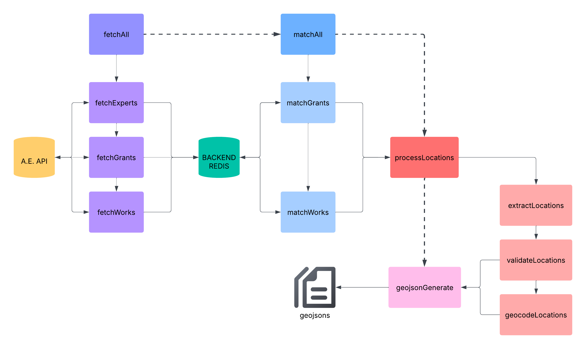

# ETL Pipeline for Expert Mapping Interface

This directory contains the Extract, Transform, Load (ETL) pipeline for the Expert Mapping Interface. The pipeline fetches data from Aggie Experts API, processes locations, and generates GeoJSON files for map visualization.

## Pipeline Flow

```
Data Extraction → Expert Matching → Location Processing → GeoJSON Generation
```

## 📋 Components

### 1. Data Extraction (`/aggieExpertsAPI`)

- **fetchExperts.js**: Retrieves expert profiles from Aggie Experts API
- **fetchWorks.js**: Retrieves research publications and works
- **fetchGrants.js**: Retrieves grant and funding information
- **fetchFeatures.js**: Manages the entire fetch process

### 2. Expert Matching (`/aggieExpertsAPI`)

- **matchWorks.js**: Associates works with experts using name matching algorithms
- **matchGrants.js**: Links grants to experts using expert URLs
- **matchFeatures.js**: Manages the complete matching process

### 3. Location Processing (`/locationAssignment`)

- **extractLocations.js**: Uses LLM (llama3.3) to identify geographic entities from text
- **validateLocations.js**: Standardizes location names against ISO references
- **geocodeLocations.js**: Converts locations to geographic coordinates
- **processLocations.js**: Manages the complete location workflow

### 4. GeoJSON Generation (`/geojsonGeneration`)

- **generateGeoJson.js**: Creates finalized GeoJSON files for the map interface
- Output files:
  - `generatedWorks.geojson`: Expert matched research work data with associated coordinates
  - `generatedGrants.geojson`: Expert matched grant data with associated coordinates

## Data Storage

- **Redis**: Temporary caching of API data
- **JSON files**: Intermediate data storage between pipeline stages
- **GeoJSON files**: Final output for the map visualization component

## Usage
Prerequisite: Backend Redis Server is Running

Run the complete pipeline:

```bash
# 1. Fetch data from Aggie Experts API
node ./src/geo/etl/aggieExpertsAPI/fetchFeatures.js

# 2. Match experts with works and grants
node ./src/geo/etl/aggieExpertsAPI/matchFeatures.js

# 3. Process and geocode locations
node ./src/geo/etl/locationAssignment/processLocations.js

# 4. Generate GeoJSON for visualization
node ./src/geo/etl/geojsonGeneration/generateGeoJson.js
```

Each component can be run individually for testing or development purposes.

