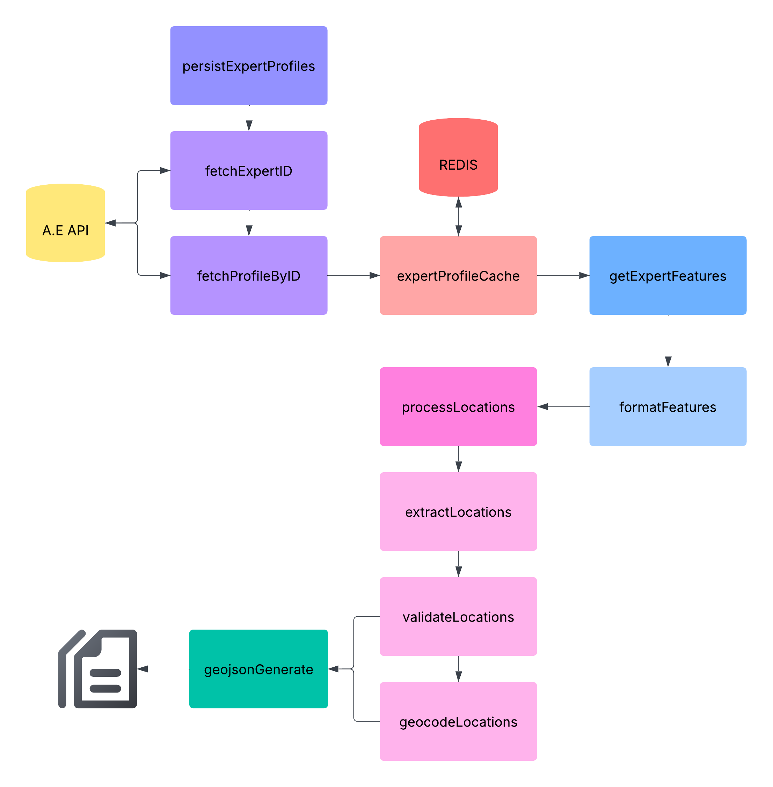

# ETL Pipeline for Expert Mapping Interface

This directory contains the Extract, Transform, Load (ETL) pipeline for the Expert Mapping Interface. The pipeline fetches data from Aggie Experts API, processes locations, and generates GeoJSON files for map visualization.

## Pipeline Flow

```
Data Extraction → Expert Matching → Location Processing → GeoJSON Generation
```

## 📋 Components

### 1. Data Extraction (`/aggieExpertsAPI`)

- **services/FetchingService.js**: Core service that handles fetching, mapping, and caching data from the Aggie Experts API (experts, works, grants) to Redis.
- **fetchFeatures.js**: Unified entry point for fetching all data types (experts, works, grants).
  - Can fetch all types at once or a specific type via command-line arguments 
  - No arguments to fetch experts, works, and grants
  - Example:
    ```bash
    node ./src/geo/etl/aggieExpertsAPI/fetchFeatures.js [expert|work|grant]
    ```
  - Requires a `.env` file in the project root with `API_TOKEN=<your-api-token>` for authentication.
  - After fetching, a summary of new and updated records is printed.

### 2. Expert Matching (`/aggieExpertsAPI`)

- **matchFeatures.js**: Orchestrates the complete matching process for works and grants to experts using the Redis cache. Outputs summary statistics.
- **services/MatchingService.js**: Contains the logic for matching works (by author name) and grants (by expert URL) to expert name and url respectively.

### 3. Location Processing (`/locationAssignment`)

- **extractLocations.js**: Uses LLM (llama3.3) to identify geographic entities from text
- **validateLocations.js**: Standardizes location names against ISO references
- **geocodeLocations.js**: Converts locations to geographic coordinates
- **processLocations.js**: Manages the complete location workflow

### 4. GeoJSON Generation (`/geojsonGeneration`)

- **generateGeoJson.js**: Creates finalized GeoJSON files for the map interface
- Output files:
  - `generatedWorks.geojson`: Research work data with coordinates
  - `generatedGrants.geojson`: Grant data with coordinates

## Data Storage

- **Redis**: Temporary caching of API data
- **GeoJSON files**: Final output for the map visualization component

## Usage

### Complete Pipeline

Run the complete ETL pipeline:

```bash
# 1. Fetch all data from Aggie Experts API
node ./src/geo/etl/aggieExpertsAPI/fetchFeatures.js

# 2. Match experts with works and grants
node ./src/geo/etl/aggieExpertsAPI/matchFeatures.js

# 3. Process and geocode locations
node ./src/geo/etl/locationAssignment/processLocations.js

# 4. Generate GeoJSON for visualization
node ./src/geo/etl/geojsonGeneration/generateGeoJson.js
```

Each component can be run individually for testing or development purposes.


