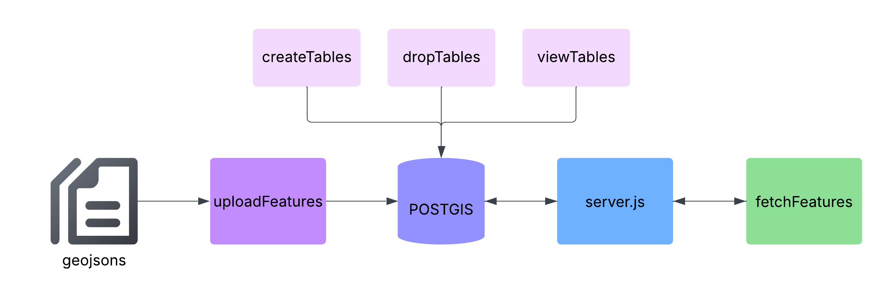

# PostGIS Database Integration

This directory contains the PostGIS database integration code for storing and retrieving geospatial expert-associated works and grants; data produced by [ETL pipeline](../etl/README.md)

## Overview

This module manages the storage and retrieval of geospatial data for the Expert Mapping Interface using PostGIS, an extension of PostgreSQL. It is responsible for:

- Storing expert-associated works and grants as GeoJSON features with geometry types: Point & Polygon
- Facilitating frontend data fetching for desired geospatial features.
- Offering utility scripts for table creation, data upload, inspection, and debugging.

The integration with PostGIS ensures that the system can handle large, complex geospatial datasets and deliver fast, interactive map-based exploration of UC Davis research activities worldwide.

---

## 📋 Components

### 1.  config.js
- Sets database configuration parameters
- Manages PostGIS connection pool setup

### 2.  createTables.js
- Initializes tables and indexes for grants and works
- Sets up proper table structure with geometric data types

### 3.  dropTables.js
- Deletes tables and their contents (CASCADE)
- Used during development or for clean reinstallation

### 4.  uploadAll.js
- Uploads generated GeoJSONs for grants and works
- Converts GeoJSON features to PostGIS geometry format

### 5.  viewTables.js
- Utility function for viewing database contents
- Helps debug and inspect database records

### 6.  fetchFeatures.js
- Utilizes endpoints in server.js to retrieve grant and work features
- Returns formatted GeoJSON's for map rendering
- Output files:
  - `workFeatures.geojson`:  Research work data with coordinates
  - `grantFeatures.geojson`: Grant data with coordinates

* © Zoey Vo, Loc Nguyen, 2025